# Setting Up My Homelab

This repository documents how I built and monitor my Proxmox homelab. The guides below include setup steps, screenshots, validation, and troubleshooting notes from the working lab.

## Guides

- [Network segmentation: OPNsense VLANs](#network-segmentation-opnsense-vlans)
- [Monitoring: Prometheus and Grafana](#monitoring-proxmox-with-prometheus-and-grafana)

## Network Segmentation: OPNsense VLANs

This guide documents a complete OPNsense and Proxmox VLAN lab built with a single physical NIC and no managed switch. It segments traffic into six VLANs — **Guest, AI, SOC, Cloud, Deception, and Targets** — and adds secure remote reachability using Tailscale subnet routing.

The procedure and troubleshooting notes are based on a working implementation and focus on practical setup details that are easy to miss in first-pass deployments.

### Why this guide exists

Most VLAN tutorials assume a managed switch is already available for physical tagging. This guide covers a common starting point for homelabs: one NIC and no additional switching hardware. In this model, VLAN segmentation still works by carrying tagged traffic on an internal Proxmox bridge that never leaves the host physically.

### Architecture overview

```text
Home Router (does real internet NAT)
        │
        │ (single physical NIC)
        ▼
   Proxmox Host
        │
   ┌────┴────┐
   │ vmbr0   │  ← physical NIC attached, WAN side
   └────┬────┘
        │
   OPNsense VM (net0 = vmbr0 = WAN)
        │
   OPNsense VM (net1 = vmbr1 = LAN trunk, no VLAN tag = trunk)
        │
   ┌────┴────┐
   │ vmbr1   │  ← VLAN-aware, NO physical port (fully virtual)
   └────┬────┘
        │
  ┌─────┼─────┬─────┬─────┬─────┬─────┐
 ai   blue  cloud decep guests targets   ← VMs, each tagged to its VLAN
(10)  (20)  (30)  (40)   (50)   (60)
```

With one NIC, that physical link is dedicated to OPNsense WAN uplink traffic. All six VLANs are carried on `vmbr1`, a VLAN-aware internal bridge with no physical bridge port. As a result, only VMs attached to `vmbr1` with matching VLAN tags participate in those networks.

### Part 1: Proxmox networking

#### 1.1 Create the internal VLAN-aware bridge

Open `Proxmox → node → System → Network → Create → Linux Bridge` and configure:

- **Name:** `vmbr1`
- **Bridge port:** leave empty (intentional; internal-only bridge)
- **VLAN aware:** enabled
- **IP address:** none required
- Apply changes

`vmbr0` remains unchanged and continues to carry WAN connectivity over the physical NIC.

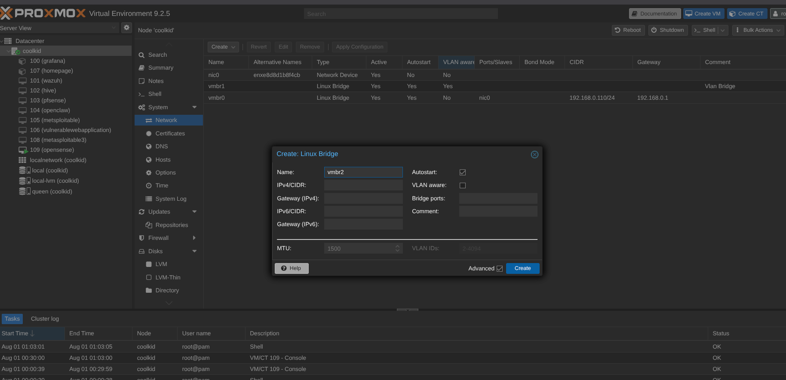
*Proxmox Network view with `vmbr1` as a VLAN-aware internal bridge and `vmbr0` mapped to the physical NIC/gateway.*

#### 1.2 Attach two virtual NICs to OPNsense

In `VM → Hardware`:

- `net0` → bridge `vmbr0` (WAN)
- `net1` → bridge `vmbr1`, **VLAN Tag left blank** (trunk carrying all VLAN tags)

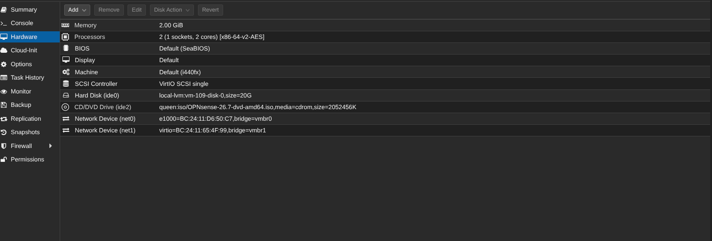
*OPNsense VM hardware configuration with `net0=vmbr0` and `net1=vmbr1`.*

### Part 2: OPNsense VLAN interfaces

#### 2.1 Create VLAN definitions

Go to `Interfaces → Other Types → VLAN → Add` and create six entries using the LAN trunk parent (shown as `vtnet0` in this environment):

| VLAN Tag | Name | Purpose |
|---|---|---|
| 10 | ai | AI workloads |
| 20 | blue | SOC / blue team |
| 30 | cloud | Cloud lab |
| 40 | deception | Deception / honeypots |
| 50 | guests | Guest devices |
| 60 | targets | Target systems |

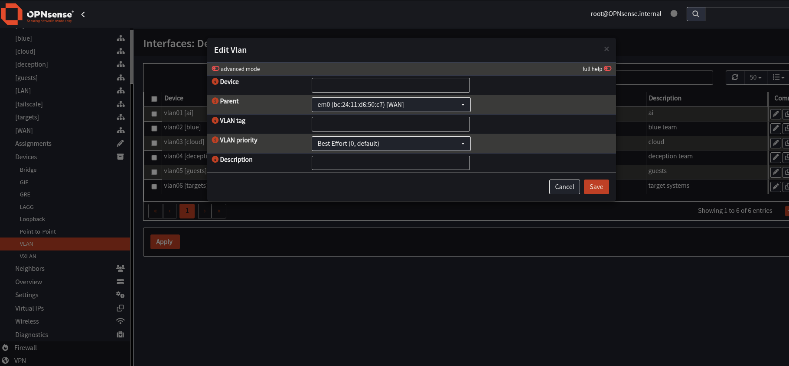
*Six VLANs created on the trunk parent with tags 10 through 60.*

#### 2.2 Assign VLANs as interfaces

In `Interfaces → Assignments`, add each `VLAN00xx on vtnet0` interface.

Do not assign the untagged parent interface (`vtnet0` with no tag) as a VLAN interface. Only assign the tagged VLAN sub-interfaces.

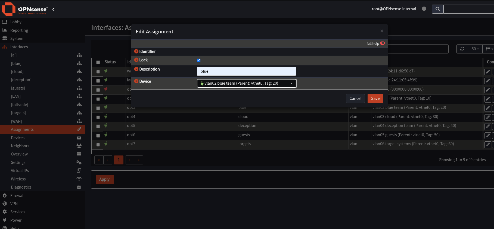
*Each VLAN mapped to an interface assignment slot (`optX`) for tags 10, 20, 30, 40, 50, and 60.*

Static gateway IPs:

| Interface | IP |
|---|---|
| ai | 192.168.10.1/24 |
| blue | 192.168.20.1/24 |
| cloud | 192.168.30.1/24 |
| deception | 192.168.40.1/24 |
| guests | 192.168.50.1/24 |
| targets | 192.168.60.1/24 |

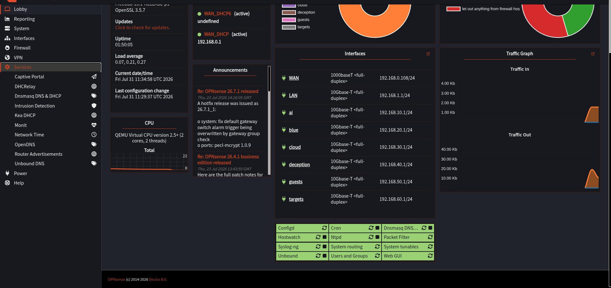
*Dashboard confirmation that LAN and all six VLAN interfaces are enabled and assigned expected gateway addresses.*

A `/24` per VLAN keeps addressing straightforward (`.1` gateway, `.100-.200` DHCP pool) while providing ample capacity for homelab workloads.

### Part 3: DHCP

#### 3.1 Dnsmasq vs Kea

For this lab size, Dnsmasq is the practical default:

- Integrated DNS + DHCP for local hostname resolution
- Lower operational complexity for small VLAN counts
- No plugin dependency for basic local name registration behavior

If migrating from Kea, disable Kea DHCP on the target interface before enabling Dnsmasq. Only one DHCP server can bind per interface.

#### 3.2 Configure Dnsmasq scopes

Two areas are essential:

1. **General**: enable Dnsmasq and select **LAN + all six VLAN interfaces**.
2. **DHCP ranges**: define one range per VLAN.

| Interface | Start | End |
|---|---|---|
| ai | 192.168.10.100 | 192.168.10.200 |
| blue | 192.168.20.100 | 192.168.20.200 |
| cloud | 192.168.30.100 | 192.168.30.200 |
| deception | 192.168.40.100 | 192.168.40.200 |
| guests | 192.168.50.100 | 192.168.50.200 |
| targets | 192.168.60.100 | 192.168.60.200 |

Default values for Domains, Hosts, DHCP options, DHCP boot, and DHCP tags are sufficient for base functionality.

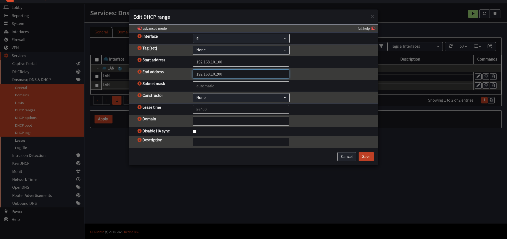
*Dnsmasq DHCP range configuration example for interface `ai`.*

### Part 4: NAT and firewall rules

#### 4.1 NAT outbound mode

Navigate to `Firewall → NAT → Outbound` and confirm mode is **Automatic**.

If set to Manual without corresponding per-subnet outbound rules, new VLANs will not have internet access.

#### 4.2 Required pass rule on each VLAN interface

Each new OPNsense interface starts with no allow rules. For every VLAN tab under `Firewall → Rules → [interface]`, create:

- **Action:** Pass
- **Protocol:** any
- **Source:** `[interface] net`
- **Destination:** any

Save each rule and apply changes.

A frequent misconfiguration is using `[interface] address` as Source. That value only matches the firewall interface IP, not client hosts in the VLAN, and therefore blocks VM traffic.

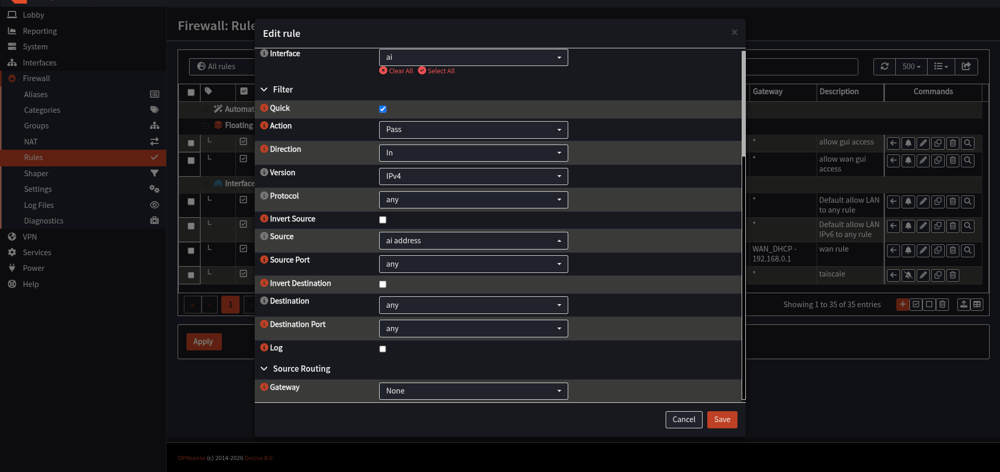
*Example of the `address` vs `net` source mismatch that prevents client traffic from matching the pass rule.*

### Part 5: Attach VMs to VLANs

For each VM network device:

- Bridge: `vmbr1`
- VLAN Tag: matching VLAN ID (for example, `30` for a Cloud/SOC VM on VLAN 30)
- Guest OS network: DHCP

No per-VM trunk configuration is required; Proxmox applies VLAN tagging at the vNIC.

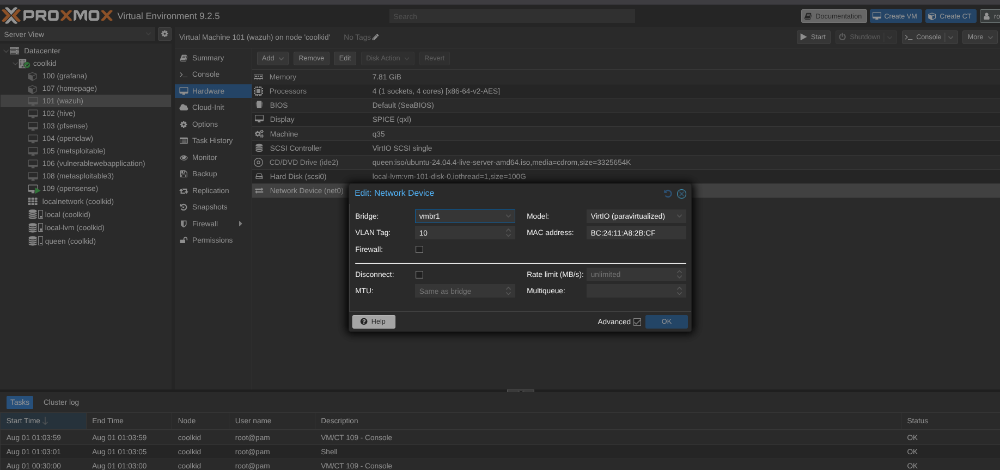
*VM network adapter assigned to `vmbr1` with VLAN tagging at the virtual NIC.*

#### Validate from inside a VM

Because there is no physical VLAN path yet, validate from VM console access (Proxmox noVNC):

```bash
ip a                    # expect an IP in the correct VLAN subnet
ping 192.168.30.1       # test VLAN gateway
ping 8.8.8.8            # test internet by IP
ping google.com         # test DNS resolution
```

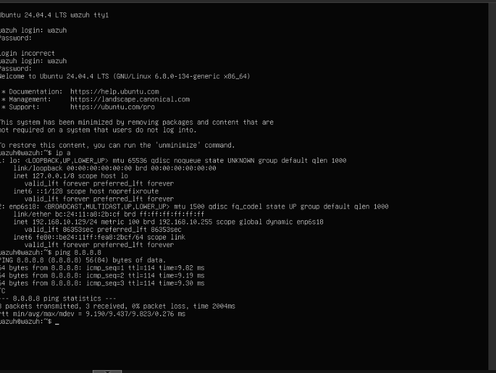
*Example validation output showing successful DHCP assignment and internet connectivity from a VLAN guest VM.*

### Troubleshooting

#### 1) VM receives APIPA address (`169.254.x.x`)

**Cause:** DHCP broadcast is not reaching OPNsense, usually due to VLAN tag or bridge mismatch.

**Checks:**

1. Confirm `vmbr1` is VLAN aware and has no bridge port.
2. Confirm VM bridge is `vmbr1` (not `vmbr0`).
3. Confirm VM VLAN Tag exactly matches the OPNsense VLAN ID.
4. Confirm a DHCP range exists for that interface.
5. Confirm guest OS NIC is set to DHCP (not static).

#### 2) VM can ping gateway but has no internet

**Likely cause:** Interface rule source uses `[interface] address` instead of `[interface] net`.

**Also verify:** NAT Outbound mode is Automatic.

#### 3) SSH to OPNsense times out

**Cause:** SSH is disabled by default, and WAN access is blocked unless explicitly allowed.

**Resolution:**

1. Enable SSH in `System → Settings → Administration`.
2. Add a temporary `Firewall → Rules → WAN` TCP/22 pass rule restricted to a specific source IP.
3. Remove or tighten the WAN SSH rule after use.
4. Use the Proxmox VM console (`Console → option 8) Shell`) as a zero-exposure alternative.

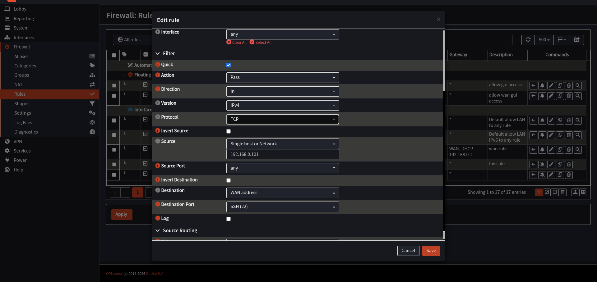
*WAN SSH rule restricted to a single source IP.*

#### 4) `tailscale status` returns “Failed to connect to local Tailscale daemon”

**Cause:** `tailscaled` service is not running.

**Resolution:**

```bash
service tailscaled status
service tailscaled start
```

#### 5) Tailscale node does not appear in admin console

**Cause:** `tailscale up` was executed, but the authentication URL was not opened and approved.

**Resolution:** Re-run `tailscale up --advertise-routes=...`, open the generated URL, and complete authorization.

#### 6) Home gateway becomes unreachable after advertising routes

**Cause:** Advertised routes overlap the home LAN subnet, or an exit node was enabled unintentionally.

**Resolution:**

- Advertise only the six VLAN subnets
- Do not advertise the home router subnet
- Keep exit node disabled on both OPNsense and client

#### 7) Tailscale does not survive OPNsense reboot

**Cause:** Community `os-tailscale` plugin behavior can overwrite manual `sysrc` persistence during boot.

**Resolution that worked in this setup:** Use `VPN → Tailscale → Settings`, enable the plugin there, and save from the plugin settings page. This hands startup management back to OPNsense service integration.

Fallback options such as `@reboot` jobs or `os-shellcmd` remain valid if needed.

#### 8) `sysrc: unknown variable 'tailscaled_enable'`

**Cause:** Variable queried before being defined.

**Resolution:**

```bash
grep -i rcvar /usr/local/etc/rc.d/tailscaled
sysrc tailscaled_enable="YES"
```

#### 9) `crontab -e` shows `:wq is not a vi command`

**Cause:** Command entered while still in insert mode.

**Resolution:** Press `Esc`, verify `-- INSERT --` is gone, then run `:wq`. Use `:q!` to exit without saving.

### Access VLAN services from a laptop before adding a second NIC

With one NIC and no managed switch, laptops remain on the home LAN (OPNsense WAN side) and have no direct layer-2 path to VLAN networks.

#### Option A: Port forward (quick, per-service)

Use `Firewall → NAT → Port Forward` to publish a specific WAN port to an internal VLAN service IP/port.

#### Option B: Tailscale subnet routes (recommended)

Advertise all six VLAN CIDRs from OPNsense, approve them in the Tailscale admin console, and enable subnet route acceptance on the laptop client.

Recommended settings:

- **OPNsense:** Advertise routes = Yes (six VLAN subnets), Exit node = No
- **Laptop:** Accept subnet routes = Yes, Use exit node = No

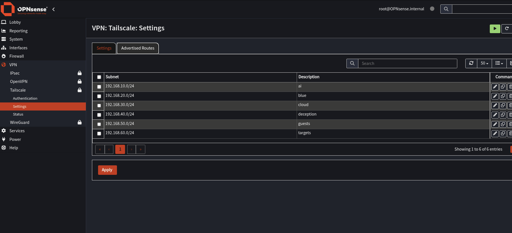
*Tailscale advertised routes for the six VLAN subnets without overlap to home LAN ranges.*

The long-term fix is to add a second NIC (or USB-to-Ethernet adapter) and bridge it into `vmbr1` for direct physical VLAN access.

### Next steps

- [ ] Add a second NIC or USB-to-Ethernet adapter for direct physical VLAN access
- [ ] Enable Suricata on Deception and Targets interfaces for IDS/IPS
- [ ] Forward OPNsense firewall and Suricata logs to Wazuh via syslog for SOC correlation
- [ ] Tighten inter-VLAN policy after baseline connectivity validation

This network setup was built on OPNsense 26.x and Proxmox VE 8.x.

## Monitoring Proxmox with Prometheus and Grafana

[Download the original Word guide](docs/Prometheus-Proxmox-Guide.docx).

A single-node Proxmox VE homelab monitored from a dedicated VM named monitor. This guide installs Grafana first, then Prometheus, then connects them and explains what each dashboard panel shows. Replace `<PROXMOX_IP>` with the address of your Proxmox host and `<monitor-vm-ip>` with the address of the monitor VM wherever they appear.

### Architecture

```text
Proxmox host <PROXMOX_IP>
  node_exporter       :9100   host CPU, RAM, disk, network
  smartctl_exporter   :9633   disk SMART health

VM "monitor" (Docker Compose)
  pve-exporter        :9221   Proxmox API -> VM, container, storage metrics
  prometheus          :9090   scrapes the four targets every 15s
  grafana             :3000   dashboards, reads from Prometheus
```

Prometheus pulls metrics on a schedule. Nothing on the Proxmox host pushes data, and the API user is read-only, so a compromised monitoring VM cannot change your guests.

### Step 1: Read-only Proxmox user and API token

Run on the Proxmox host (Datacenter, your node, Shell). The pve realm gives API access without a shell on the host.

```bash
pveum user add prometheus@pve --comment "Prometheus exporter"
pveum acl modify / --users prometheus@pve --roles PVEAuditor
pveum user token add prometheus@pve exporter --privsep 0
```

The last command prints the token secret once. Copy it now. With --privsep 0 the token inherits the user's PVEAuditor permissions.

The user now holds seven *.Audit privileges at / with propagate enabled. That is exactly the built-in PVEAuditor role: it can read everything and change nothing.

### Step 2: Exporters on the Proxmox host

#### node exporter (host CPU, memory, disk, network)

```bash
apt update
apt install -y prometheus-node-exporter
systemctl enable --now prometheus-node-exporter
curl -s http://localhost:9100/metrics | head
```

#### smartctl exporter (disk health)

Find the current version on the prometheus-community/smartctl_exporter releases page and substitute it for VERSION.

```bash
apt install -y smartmontools
cd /tmp
wget https://github.com/prometheus-community/smartctl_exporter/releases/download/vVERSION/smartctl_exporter-VERSION.linux-amd64.tar.gz
tar xzf smartctl_exporter-VERSION.linux-amd64.tar.gz
install -m 755 smartctl_exporter-VERSION.linux-amd64/smartctl_exporter /usr/local/bin/
```

Create /etc/systemd/system/smartctl_exporter.service:

```ini
[Unit]
Description=smartctl exporter
After=network.target

[Service]
ExecStart=/usr/local/bin/smartctl_exporter --web.listen-address=:9633
Restart=on-failure

[Install]
WantedBy=multi-user.target
```

```bash
systemctl daemon-reload
systemctl enable --now smartctl_exporter
curl -s http://localhost:9633/metrics | grep smartctl_device | head
```

The exporter runs as root because SMART needs raw disk access, so limit port 9633 to the monitor VM (see Hardening).

### Step 3: Install Grafana

On the monitor VM, install Docker and create a working directory. Save the `docker-compose.yml` example in Step 4 in that directory, then start only Grafana:

```bash
mkdir -p monitoring && cd monitoring
docker compose up -d grafana
docker compose ps
```

Open http://`<monitor-vm-ip>`:3000. The default login is admin / admin, and Grafana asks you to set a new password immediately. Do that before anything else.

Grafana is empty at this point. It has nothing to read until Prometheus exists.

### Step 4: Install Prometheus and pve-exporter

Create `pve.yml` and paste the token secret from Step 1:

```bash
nano pve.yml
chmod 600 pve.yml
```

```yaml
default:
  user: prometheus@pve
  token_name: exporter
  token_value: PASTE_TOKEN_SECRET_HERE
  verify_ssl: false
```

`verify_ssl: false` accepts Proxmox's self-signed certificate on a trusted LAN. Keep this credential file out of version control.

The docker-compose.yml used for all three services:

```yaml
services:
  grafana:
    image: grafana/grafana:latest
    volumes:
      - grafana-data:/var/lib/grafana
    ports: ["3000:3000"]
    restart: unless-stopped

  prometheus:
    image: prom/prometheus:latest
    volumes:
      - ./prometheus.yml:/etc/prometheus/prometheus.yml:ro
      - prometheus-data:/prometheus
    ports: ["9090:9090"]
    restart: unless-stopped

  pve-exporter:
    image: prompve/prometheus-pve-exporter:latest
    volumes:
      - ./pve.yml:/etc/prometheus/pve.yml:ro
    ports: ["9221:9221"]
    restart: unless-stopped

volumes:
  grafana-data:
  prometheus-data:
```

### Step 5: Configure Prometheus

All behaviour is defined in prometheus.yml. It has four scrape jobs:

| Job | Target | What it provides |
| --- | --- | --- |
| prometheus | prometheus:9090 | Prometheus's own health |
| node | `<PROXMOX_IP>`:9100 | Host CPU, RAM, disk, network |
| smartctl | `<PROXMOX_IP>`:9633 | SMART health and temperature of physical disks |
| proxmox | `<PROXMOX_IP>` via pve-exporter:9221 | VMs, containers, storage and node info from the Proxmox API |

```yaml
global:
  scrape_interval: 15s

scrape_configs:
  - job_name: prometheus
    static_configs:
      - targets: ["prometheus:9090"]

  - job_name: node
    static_configs:
      - targets: ["<PROXMOX_IP>:9100"]

  - job_name: smartctl
    static_configs:
      - targets: ["<PROXMOX_IP>:9633"]

  - job_name: proxmox
    metrics_path: /pve
    params:
      module: [default]
    static_configs:
      - targets: ["<PROXMOX_IP>"]
    relabel_configs:
      - source_labels: [__address__]
        target_label: __param_target
      - target_label: __address__
        replacement: pve-exporter:9221
```

The proxmox job is the unusual one. Prometheus asks the exporter to query the Proxmox API at a target, so the relabeling moves the Proxmox address into the target URL parameter and points the actual scrape at the exporter instead.

Save the configuration above as `prometheus.yml` in the same directory as `docker-compose.yml`, then start the remaining services:

```bash
docker compose up -d prometheus pve-exporter
docker compose ps
```

Open `http://<monitor-vm-ip>:9090`, then go to Status, Target health. All four jobs must show UP. After future edits to `prometheus.yml`, reload with `docker compose restart prometheus`.

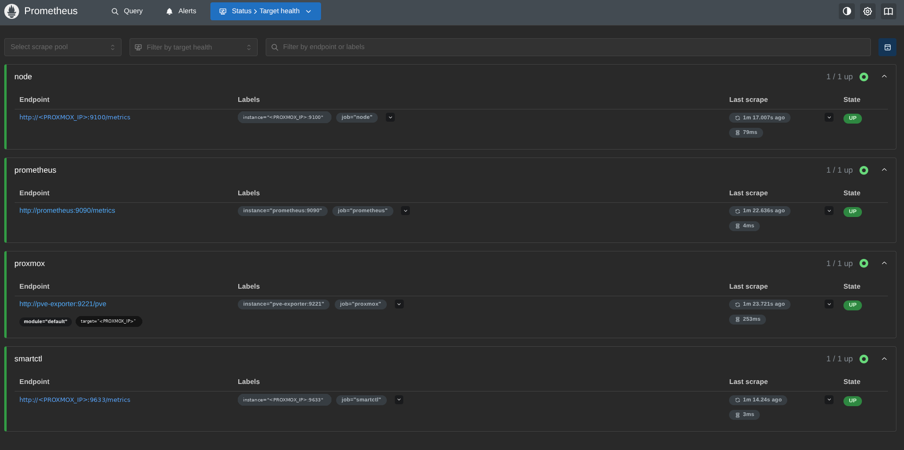

*Figure 1. Prometheus target health: all four jobs up (host address redacted)*

To see the raw data behind the dashboard, open the Query page and run pve_up (1 means the exporter reached Proxmox) or pve_guest_info (one row per VM and container).

### Step 6: Connect Grafana to Prometheus

- In Grafana go to Connections, Data sources, Add data source, Prometheus.
- Set the URL to http://prometheus:9090. The container name resolves inside the Compose network.
- Click Save & test and wait for the success message.

Then import a ready-made dashboard: Dashboards, New, Import, enter ID 10347 ("Proxmox via Prometheus"), and select the Prometheus data source.

### What the dashboard shows

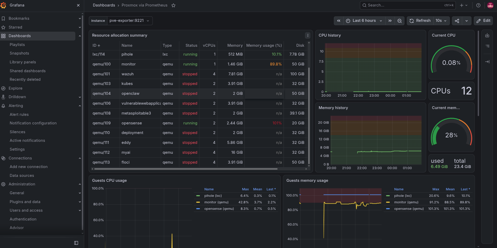

*Figure 2. The Proxmox via Prometheus dashboard in Grafana*

The instance dropdown at the top selects which exporter to read. Here it is pve-exporter:9221, the instance label produced by the relabeling in Step 5. Each panel is a PromQL query over metrics from the jobs above:

| Panel | Source job | What it reads |
| --- | --- | --- |
| Resource allocation summary | proxmox | One row per guest: ID, name, type (lxc or qemu), status, vCPUs, memory, memory usage, disk. Built from pve_guest_info joined with pve_memory_size_bytes, pve_memory_usage_bytes and pve_disk_size_bytes. |
| CPU history, Current CPU, CPUs | proxmox / node | Host CPU usage over time, the current value as a gauge, and the total core count. |
| Memory history, Current mem | proxmox / node | Host memory used and total, over time and as a gauge. |
| Guests CPU usage | proxmox | pve_cpu_usage_ratio per running guest, with max, mean and last in the legend. |
| Guests memory usage | proxmox | pve_memory_usage_bytes divided by pve_memory_size_bytes per running guest. |

Stopped guests appear in the table as "stopped" with n/a usage and are absent from the usage graphs, because a stopped guest reports no CPU or memory. The metric names above are the usual ones for this exporter; to see the exact query behind any panel, open its menu and choose Edit.

### Step 7: Create alerts

Dashboards show problems after you look at them. Alert rules in Grafana watch the same Prometheus data and notify you when something crosses a threshold.

- Go to Alerting, Alert rules, New alert rule.
- Enter a name, for example High guest CPU.
- Choose the prometheus data source, switch the query editor to Code, and enter a PromQL query.
- Under Alert condition set WHEN QUERY IS ABOVE (or below) a threshold, then click Preview alert rule condition to see what would fire.
- Choose a folder, an evaluation group and interval (1m is a good start), and a pending period so a single spike does not fire.
- Pick a contact point. Create one first under Alerting, Notification configuration (email, Telegram, Discord or a webhook).

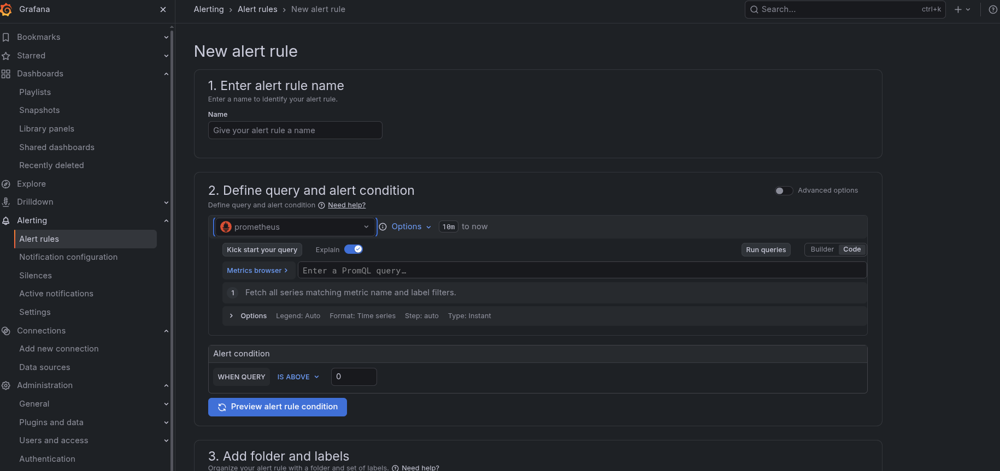

*Figure 3. New alert rule form: name, query and alert condition*

A saved rule shows its query, the current state of every series it covers, and the threshold. The Instances tab lists one entry per matching series.

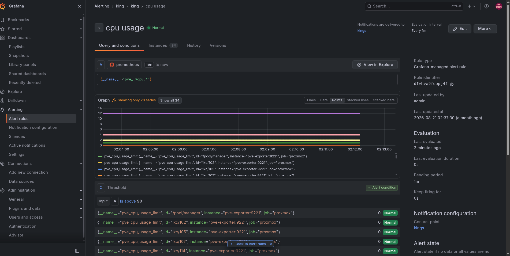

*Figure 4. An existing rule: query, evaluation graph and threshold*

#### Useful starting rules

| Alert | Query | Condition |
| --- | --- | --- |
| Guest CPU high | pve_cpu_usage_ratio | Is above 0.9 |
| Guest memory high | pve_memory_usage_bytes / pve_memory_size_bytes | Is above 0.9 |
| Proxmox API unreachable | pve_up | Is below 1 |
| Any target down | up | Is below 1 |
| Disk SMART failing | smartctl_device_smart_status | Is below 1 |

Check metric names in the Metrics browser before saving, since exporter versions can rename them. The CPU and memory rules fire per guest, so one rule covers every VM and container.

#### Common mistake: matching too many metrics

A regex query such as {__name__=~"pve_.*cpu.*"} matches every CPU metric, including pve_cpu_usage_limit, which is the number of vCPUs a guest has (2, 4, 12 and so on), not its usage. It also makes the instance count jump, because each metric multiplies the series. Query pve_cpu_usage_ratio directly.

Also match the threshold to the unit. pve_cpu_usage_ratio is a fraction from 0 to 1, so a threshold of 90 can never be reached. Use 0.9 for 90%, or multiply the query by 100.

### Troubleshooting

| Symptom | Likely cause and fix |
| --- | --- |
| proxmox target down or 5xx | pve-exporter cannot log in. Run docker compose logs pve-exporter and check the token name, secret and user. |
| Target UP but no VM data | The token has privilege separation on and no ACL of its own. Recreate it with --privsep 0, or grant PVEAuditor to prometheus@pve!exporter. |
| TLS certificate error | Set verify_ssl: false in pve.yml, or trust your CA. |
| node or smartctl down | Service not running or blocked. Test curl http://`<PROXMOX_IP>`:9100/metrics from the monitor VM and check the Proxmox firewall. |
| Grafana data source test fails | Wrong URL. Inside Compose use http://prometheus:9090, not localhost. |
| Dashboard empty | Wrong data source, or the instance dropdown points at the wrong target. Pick pve-exporter:9221. |

### Hardening and next steps

- Memory on the monitor VM. Give it enough RAM. If the dashboard shows it near 90%, raise it before Prometheus data grows, or the kernel OOM killer will pick a container.
- Guests above 100% memory. A VM can report more than 100% memory usage in the dashboard. This is usually ballooning or guest accounting, not a leak. Check the VM's balloon setting and its memory inside the guest.
- Limit exposure. Allow ports 9100 and 9633 only from the monitor VM's IP using the Proxmox firewall. Put Grafana behind a reverse proxy with TLS if it leaves your LAN.
- Retention. Prometheus keeps 15 days by default. Add --storage.tsdb.retention.time=30d to its command if you want longer.
- Alerting. Create the starter rules from Step 7 and test the contact point with a deliberately low threshold, so you know a notification really arrives.
- Secrets. Keep pve.yml out of version control. Never commit the token, and rotate it if it leaks.
